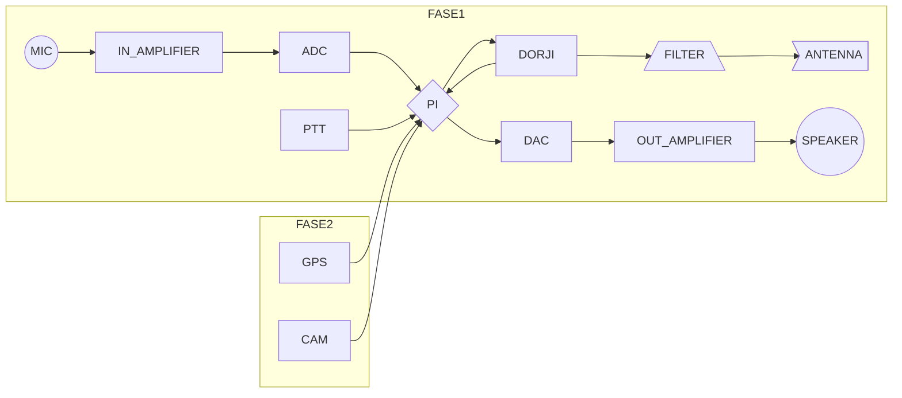

# Arquitectura propuesta

```mermaid
graph LR;
    subgraph FASE1
    PI{PI}-->DORJI;
    DORJI-->PI;
    PI-->DAC;
    MIC-->IN_AMPLIFIER;
    IN_AMPLIFIER-->ADC;
    ADC-->PI;
    PTT-->PI;
    DORJI-->FILTER;
    FILTER-->ANTENNA;
    DAC-->OUT_AMPLIFIER;
    OUT_AMPLIFIER-->SPEAKER;
    end
    subgraph FASE2
    GPS-->PI;
    CAM-->PI;
    end
    ANTENNA>ANTENNA]
    FILTER[/FILTER\]
    MIC((MIC))
    SPEAKER((SPEAKER))
```