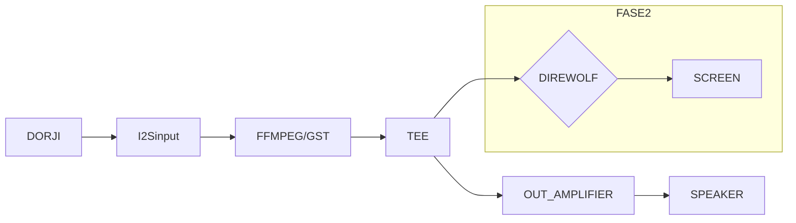
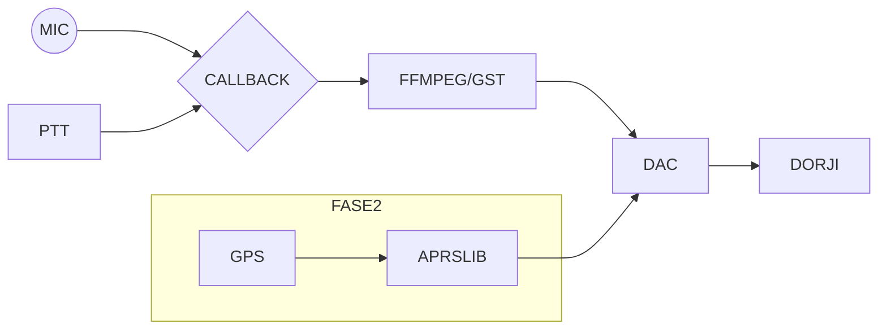
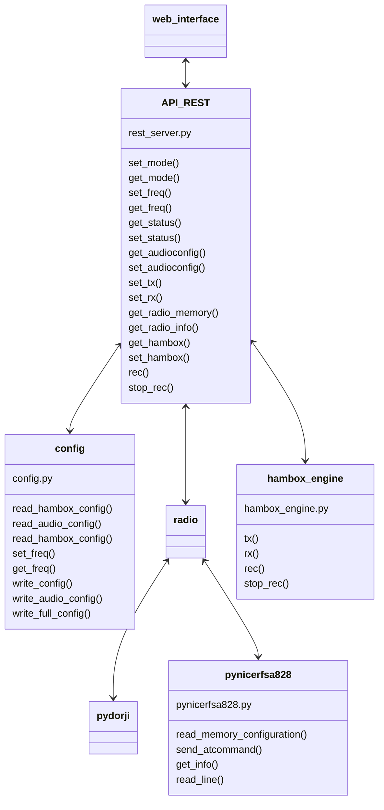
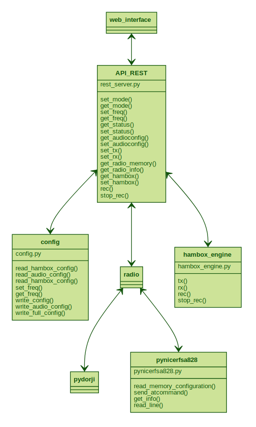

# Input FM from DORJI module

```mermaid
graph LR;
    DORJI --> I2Sinput
    I2Sinput --> FFMPEG/GST
    FFMPEG/GST --> TEE
    TEE --> OUT_AMPLIFIER
    OUT_AMPLIFIER --> SPEAKER
    TEE --> DIREWOLF{DIREWOLF}
    subgraph FASE2
    DIREWOLF{DIREWOLF} --> SCREEN
    end
```

# Output to DORJI FM 

```mermaid
graph LR;
    MIC((MIC)) --> CALLBACK{CALLBACK}
    PTT --> CALLBACK{CALLBACK}
    CALLBACK{CALLBACK} --> FFMPEG/GST
    FFMPEG/GST --> DAC
    DAC --> DORJI
    subgraph FASE2
    GPS --> APRSLIB
    end
    APRSLIB --> DAC
```

# Stack

```mermaid
classDiagram
API_REST <--> config
API_REST <--> radio
API_REST : rest_server.py
API_REST: set_mode()
API_REST: get_mode()
API_REST: set_freq()
API_REST: get_freq()
API_REST: get_status()
API_REST: set_status()
API_REST: get_audioconfig()
API_REST: set_audioconfig()
API_REST: set_tx()
API_REST: set_rx()
API_REST: get_radio_memory()
API_REST: get_radio_info()
API_REST: get_hambox()
API_REST: set_hambox()
API_REST: rec()
API_REST: stop_rec()
web_interface <-->API_REST
config: config.py
config: read_hambox_config()
config: read_audio_config()
config: read_hambox_config()
config: set_freq()
config: get_freq()
config: write_config()
config: write_audio_config()
config: write_full_config()
API_REST<--> hambox_engine
hambox_engine: hambox_engine.py
hambox_engine: tx()
hambox_engine: rx()
hambox_engine: rec()
hambox_engine: stop_rec()
radio <--> pydorji
radio <-->pynicerfsa828
pynicerfsa828: read_memory_configuration()
pynicerfsa828: pynicerfsa828.py
pynicerfsa828: send_atcommand()
pynicerfsa828: get_info()
pynicerfsa828: read_line()
```

