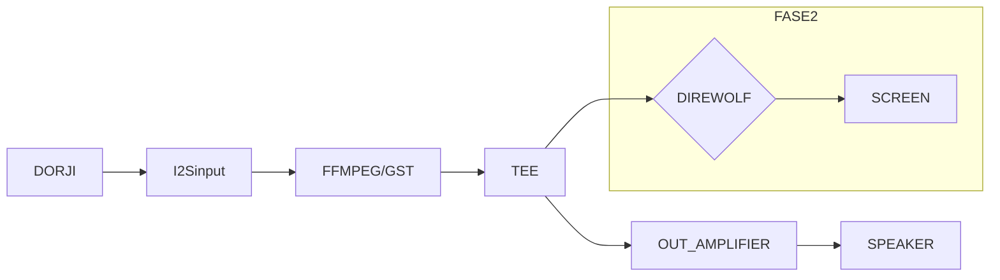
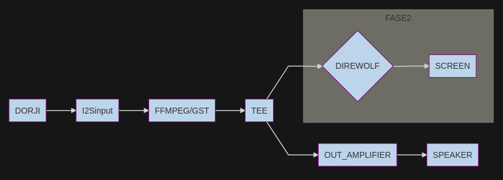
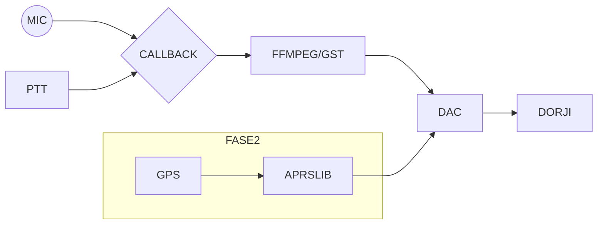
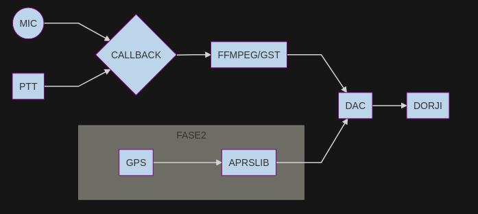

# Input FM from DORJI module

```mermaid
graph LR;
    DORJI --> I2Sinput
    I2Sinput --> FFMPEG/GST
    FFMPEG/GST --> TEE
    TEE --> OUT_AMPLIFIER
    OUT_AMPLIFIER --> SPEAKER
    TEE --> DIREWOLF{DIREWOLF}
    subgraph FASE2
    DIREWOLF{DIREWOLF} --> SCREEN
    end
```

# Output to DORJI FM 

```mermaid
graph LR;
    MIC((MIC)) --> CALLBACK{CALLBACK}
    PTT --> CALLBACK{CALLBACK}
    CALLBACK{CALLBACK} --> FFMPEG/GST
    FFMPEG/GST --> DAC
    DAC --> DORJI
    subgraph FASE2
    GPS --> APRSLIB
    end
    APRSLIB --> DAC
```

